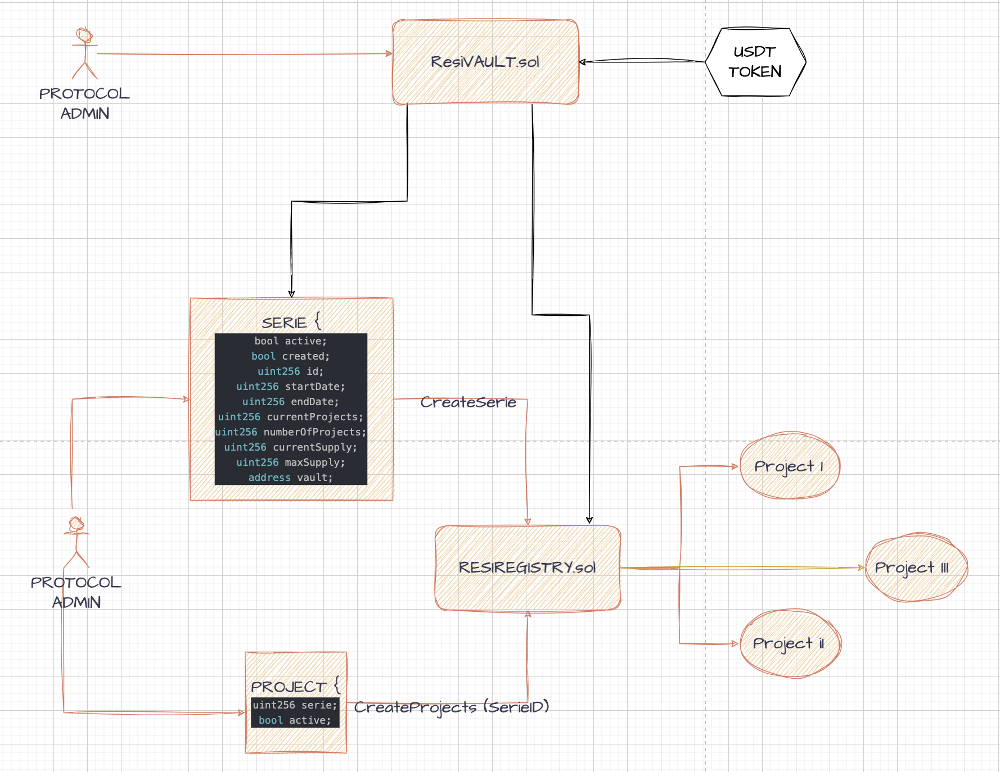

# $RESI-TOKEN

- Resi Token de la Comunidad Resiliente.

[](https://github.com/Comunidad-Resiliente/Resi-Token/releases/)
[](#license)
[](https://github.com/Comunidad-Resiliente/Resi-Token/issues)

---

### Contracts

- ResiRegistry.sol

- ResiVault.sol

- ResiToken.sol

- ResiSBT.sol



### Tokenomics

**Roles**:

- MENTOR:

- PROJECT BUILDER:

- RESI BUILDER:

- TREASURY:

---

#### Stack

- yarn
- Node js v18
- Typescript
- Hardhat

#### Commands

- Install:

```bash
yarn
```

- Compile contracts:

```bash
yarn compile
```

- Deploy locally:

```bash
yarn deploy
```

- Deploy to live network: For this step you would need to provide your MNEMONIC inside .envrc file

```bash
export MNEMONIC='YOUR MNEMONIC'

direnv allow .envrc
```

And then run:

```bash
yarn deploy:network <network>
```

- Run Test:

```bash
yarn test
```

- Run coverage:

```bash
yarn coverage
```

- Generate abis:

```bash
yarn abis
```

- Know the size of your contracts:

```bash
yarn size
```

### Roadmap

* [X] Desarrollo
* [] Test >= 90%
* [] Deploy a testnet mumbai
* [] Desarrollo de los subgrafos asociados
* [] Desarrollo del front-end asociado
* [] Auditoría de contratos
* [] Deploy mainnet

### Autores

- Alejo Lovallo

  - [Github](https://github.com/AlejoLovallo)
  - [Medium](https://alejolovallo.medium.com/)
