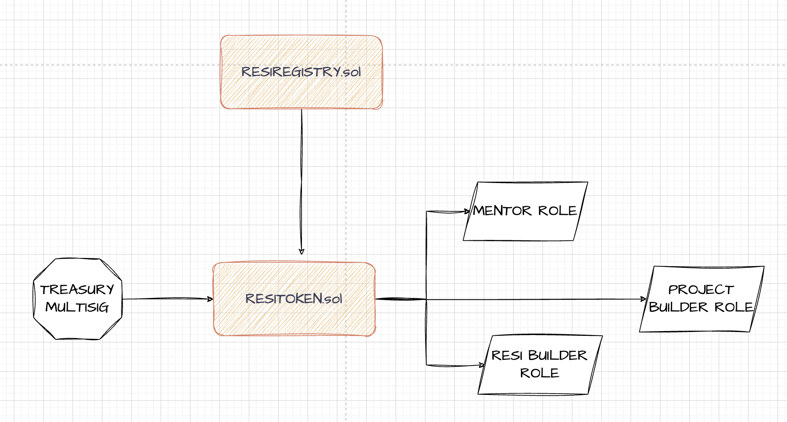
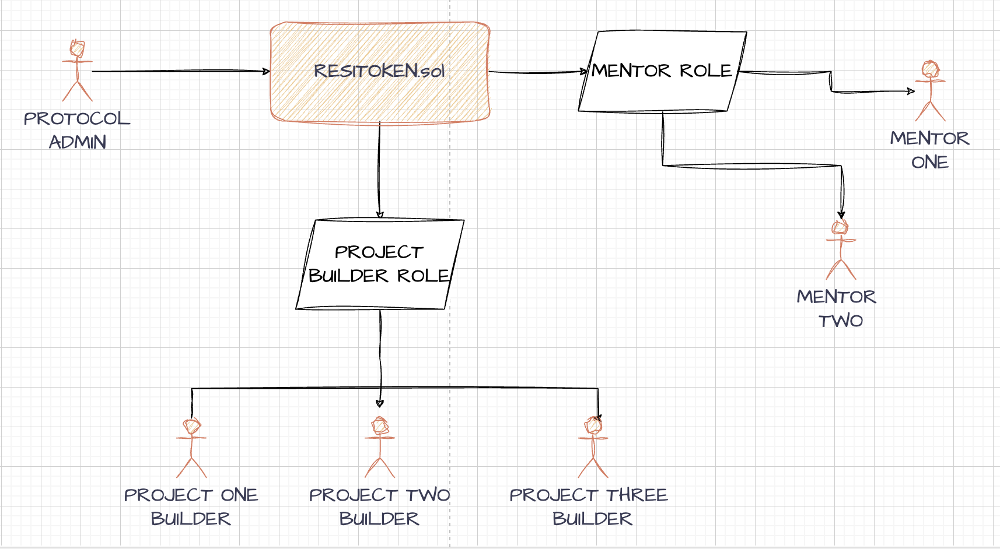

# $RESI-TOKEN

- Resi Token de la Comunidad Resiliente.

[](https://github.com/Comunidad-Resiliente/Resi-Token/releases/)
[](#license)
[](https://github.com/Comunidad-Resiliente/Resi-Token/issues)

---

### Contracts

- ResiRegistry.sol: Main admin of the protocol. Where Series and projects are created and handled.

- ResiVault.sol: Each Serie wiil have its own vault to securely store funds from convertible notes and pre-funded series.

- ResiToken.sol: Token which holds roles and funcitons to interact with Series.

- ResiSBT.sol: SBT per Serie holding data from each available role in Resi Token ecosystem. (See #Roles).






### Tokenomics

**Roles**:

- MENTOR:

- PROJECT BUILDER:

- RESI BUILDER:

- TREASURY:

---

#### Stack

- yarn
- Node js v18
- Typescript
- Hardhat

#### Commands

- Install:

```bash
yarn
```

- Compile contracts:

```bash
yarn compile
```

- Deploy locally:

```bash
yarn deploy
```

- Deploy to live network: For this step you would need to provide your MNEMONIC inside .envrc file

```bash
export MNEMONIC='YOUR MNEMONIC'

direnv allow .envrc
```

And then run:

```bash
yarn deploy:network <network>
```

- Run Test:

```bash
yarn test
```

- Run coverage:

```bash
yarn coverage
```

- Generate abis:

```bash
yarn abis
```

- Know the size of your contracts:

```bash
yarn size
```

- Verify contracts: due to they are all upgradeable contracts, we just need to provide the address of the deployed contract and the network. Also, do not forget to provide the api key of your network to your hardhat.config.ts. For instance, to verify on Polygon Mumbai testnet:

```js
etherscan: {
    apiKey: {
      polygonMumbai: process.env.MUMBAI_ETHERSCAN_API_KEY ? process.env.MUMBAI_ETHERSCAN_API_KEY : ''
    }
  },
```

```bash
npx hardhat verify --network <NETWORK> <CONTRACT_ADDRESS>
```

---

### Tasks

1. Create serie

```bash
npx hardhat create-serie --start-date <YYYY/MM/DD> --end-date <YYYY/MM/DD> --projects <NUMBER> --max-supply <VALUE IN WEI> --vault <VAULT_ADDRESS> --network <NETWORK>
```

2. Set default role uri: This task has to be done per role.

```bash
npx hardhat set-default-role-uri --role <ROLE_NAME> --uri <URI> --network <NETWORK>
```

3. Register Serie SBT

```bash
npx hardhat register-serie-sbt --sbt <SBT_ADDRESS> --network <NETWORK>
```

4. Set ResiToken

```bash
npx hardhat set-resi-token --resi-token <RESI_TOKEN_ADDRESS> --network <NETWORK>
```

5. Set Treasury Vault

```bash
npx hardhat set-treasury-vault --treasury-vault <TREASURY_ADDRESS> --network mumbai
```

6. Add Project

```bash
npx hardhat add-project --name <PROJECT_NAME> --network <NETWORK>
```

7. Add role

```bash

```

8. Add roles batch

```bash

```

9. Award

```bash


```

### Roadmap

- [x] Development
- [x] Test coverage >= 90%
- [x] Deploy to testnet mumbai
- [] Development of associated subgraphs
- [] Front end develpment
- [] SC Auditory
- [] Mainnet deploy

### Autores

- Alejo Lovallo

  - [Github](https://github.com/AlejoLovallo)
  - [Medium](https://alejolovallo.medium.com/)
